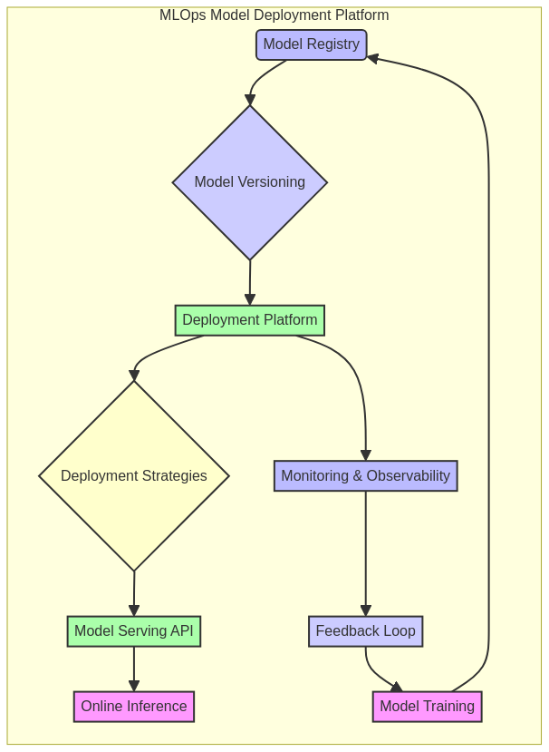

# MLOps Model Deployment Platform


---

## 🇧🇷 Plataforma de Deploy de Modelos MLOps

Este repositório apresenta uma **plataforma completa para o deploy e gerenciamento de modelos de Machine Learning (ML) em produção**, seguindo as melhores práticas de MLOps. O foco é em automatizar o ciclo de vida do modelo, desde o treinamento e versionamento até a implantação, monitoramento e retreinamento, garantindo **escalabilidade, confiabilidade e reprodutibilidade** em ambientes de produção.

### 🎯 Objetivo

O principal objetivo deste projeto é **fornecer um guia detalhado e exemplos de código funcional** para engenheiros de ML, cientistas de dados e arquitetos que buscam construir ou otimizar suas pipelines de MLOps. Serão abordados os conceitos fundamentais, ferramentas e tecnologias para criar uma plataforma robusta de deploy de modelos, com ênfase em **versionamento de modelos, estratégias de deployment avançadas e uma API de inferência em tempo real**.

### ✨ Destaques

- **Versionamento de Modelos**: Implementação de um registro de modelos (`ModelRegistry`) que suporta versionamento (`ModelMetadata`), permitindo o gerenciamento de diferentes versões de modelos e seus metadados associados.
- **Estratégias de Deployment Avançadas**: Suporte a diversas estratégias de deployment, como **Blue/Green** e **Canary Releases**, para garantir transições seguras e controladas de modelos em produção, minimizando riscos e tempo de inatividade.
- **API de Inferência em Tempo Real (Flask)**: Uma API RESTful construída com **Flask** para servir previsões de modelos implantados, permitindo que aplicações consumam os modelos com baixa latência e alta disponibilidade.
- **Monitoramento e Escalabilidade**: Mecanismos para simular o monitoramento de modelos em produção e a capacidade de escalar deployments (`scale_deployment`) para lidar com cargas de trabalho variáveis, garantindo resiliência e performance.
- **Automação Completa**: Demonstração de como automatizar o ciclo de vida do modelo, desde o registro até o deploy e undeploy, seguindo princípios de CI/CD.
- **Código Profissional**: Exemplos de código bem estruturados, seguindo as melhores práticas da indústria, com foco em modularidade, reusabilidade e manutenibilidade.
- **Documentação Completa**: Cada componente da plataforma é acompanhado de documentação detalhada, diagramas explicativos e casos de uso práticos.
- **Testes Incluídos**: Módulos de código validados através de testes unitários e de integração, garantindo a robustez e a confiabilidade das soluções.

### 🚀 Benefícios do MLOps em Ação

A implementação de práticas de MLOps traz uma série de benefícios cruciais para o desenvolvimento e operação de modelos de ML em escala. Este projeto ilustra como esses benefícios são alcançados:

1.  **Ciclo de Vida Acelerado:** A automação do registro, deployment e monitoramento de modelos acelera o tempo de lançamento de novos modelos e atualizações.

2.  **Confiabilidade e Estabilidade:** Estratégias de deployment como Blue/Green e Canary garantem que novas versões de modelos sejam introduzidas com segurança, minimizando o impacto em caso de falhas.

3.  **Reprodutibilidade:** O versionamento de modelos e a gestão de metadados permitem a reprodução exata de deployments anteriores, essencial para auditorias e depuração.

4.  **Colaboração Aprimorada:** A plataforma fornece uma interface padronizada para cientistas de dados e engenheiros de ML interagirem com o ciclo de vida do modelo.

5.  **Monitoramento Contínuo:** Embora simulado, o framework prevê a integração de ferramentas de monitoramento para detectar problemas de performance e *drift* de dados/modelo, acionando ações corretivas.

6.  **Governança e Conformidade:** O registro de modelos e o rastreamento de versões fornecem a base para uma governança robusta e conformidade com regulamentações.

---

## 🇬🇧 MLOps Model Deployment Platform

This repository presents a **complete platform for deploying and managing Machine Learning (ML) models in production**, following MLOps best practices. The focus is on automating the model lifecycle, from training and versioning to deployment, monitoring, and retraining, ensuring **scalability, reliability, and reproducibility** in production environments.

### 🎯 Objective

The main objective of this project is to **provide a detailed guide and functional code examples** for ML engineers, data scientists, and architects looking to build or optimize their MLOps pipelines. It will cover fundamental concepts, tools, and technologies to create a robust model deployment platform, with an emphasis on **model versioning, advanced deployment strategies, and a real-time inference API**.

### ✨ Highlights

- **Model Versioning**: Implementation of a `ModelRegistry` that supports versioning (`ModelMetadata`), allowing the management of different model versions and their associated metadata.
- **Advanced Deployment Strategies**: Support for various deployment strategies, such as **Blue/Green** and **Canary Releases**, to ensure safe and controlled transitions of models in production, minimizing risks and downtime.
- **Real-time Inference API (Flask)**: A RESTful API built with **Flask** to serve predictions from deployed models, allowing applications to consume models with low latency and high availability.
- **Monitoring and Scalability**: Mechanisms to simulate monitoring of models in production and the ability to scale deployments (`scale_deployment`) to handle varying workloads, ensuring resilience and performance.
- **Full Automation**: Demonstration of how to automate the model lifecycle, from registration to deployment and undeployment, following CI/CD principles.
- **Professional Code**: Well-structured code examples, following industry best practices, with a focus on modularity, reusability, and maintainability.
- **Complete Documentation**: Each platform component is accompanied by detailed documentation, explanatory diagrams, and practical use cases.
- **Tests Included**: Code modules validated through unit and integration tests, guaranteeing the robustness and reliability of the solutions.

### 📊 Visualization



*Diagrama ilustrativo da arquitetura da Plataforma de Deploy de Modelos MLOps, destacando os principais componentes e o fluxo de trabalho.*


---

## 🛠️ Tecnologias Utilizadas / Technologies Used

| Categoria         | Tecnologia      | Descrição                                                                 |
| :---------------- | :-------------- | :------------------------------------------------------------------------ |
| **Linguagem**     | Python          | Linguagem principal para desenvolvimento da plataforma MLOps e API.       |
| **Framework Web** | Flask           | Utilizado para construir a API RESTful de inferência de modelos.          |
| **Contêineres**   | Docker          | Para empacotar modelos e suas dependências, garantindo portabilidade.     |
| **Orquestração**  | Kubernetes      | (Conceitual) Para orquestração e gerenciamento de deployments em escala.  |
| **Versionamento** | MLflow          | (Conceitual) Para rastreamento de experimentos e registro de modelos.     |
| **Serialização**  | Pickle / JSON   | Para persistência de modelos e comunicação da API.                        |
| **Testes**        | `unittest`      | Framework de testes padrão do Python para validação de funcionalidades.   |
| **Diagramação**   | Mermaid         | Para criação de diagramas de arquitetura e fluxo de trabalho no README.   |
| **Dados**         | `pandas`, `numpy` | Para manipulação e geração de dados no exemplo avançado.                  |
| **ML**            | `scikit-learn`  | Para treinamento de modelos de Machine Learning no exemplo avançado.      |

---

## 📁 Repository Structure

```
mlops-model-deployment-platform/
├── src/
│   ├── __init__.py
│   ├── model_deployment.py      # Lógica principal da plataforma de deployment
│   ├── model_serving_api.py     # Implementação da API Flask para inferência
│   └── advanced_example.py      # Módulo de exemplo avançado com treinamento e deploy
├── data/                        # Dados de exemplo e modelos pré-treinados
├── images/                      # Imagens e diagramas para o README e documentação
├── tests/                       # Testes unitários e de integração
├── docs/                        # Documentação adicional, guias e whitepapers sobre MLOps
├── config/                      # Arquivos de configuração (ex: para ambiente de deploy)
├── models/                      # Diretório para armazenar modelos versionados
├── requirements.txt             # Dependências Python
└── README.md                    # Este arquivo
```

---

## 🚀 Getting Started

Para começar, clone o repositório e explore os diretórios `src/` e `docs/` para exemplos detalhados e instruções de uso. Certifique-se de ter as dependências necessárias instaladas.

### Pré-requisitos

- Python 3.9+
- `pip` (gerenciador de pacotes Python)
- `scikit-learn` (para o modelo de exemplo)
- `pandas` (para manipulação de dados no exemplo avançado)
- `requests` (para interagir com a API no exemplo avançado)

### Instalação

```bash
git clone https://github.com/GabrielDemetriosLafis/mlops-model-deployment-platform.git
cd mlops-model-deployment-platform

# Instalar dependências Python
pip install -r requirements.txt
```

### Exemplo de Uso Avançado (Python)

O módulo `src/advanced_example.py` demonstra um ciclo de vida MLOps mais completo, incluindo:

- Geração de dados sintéticos para um problema de classificação.
- Treinamento de um modelo `RandomForestClassifier` com `scikit-learn`.
- Registro do modelo na `DeploymentPlatform`.
- Promoção do modelo para ambientes de staging e produção.
- Início de uma API de inferência em tempo real (Flask).
- Realização de deployment com estratégia Blue/Green.
- Simulação de previsões via API.
- Treinamento e registro de uma nova versão do modelo.
- Realização de deployment com estratégia Canary Release para a nova versão.
- Simulação de tráfego entre as versões para teste do Canary.
- Promoção da versão Canary para produção completa.
- Desativação da versão antiga do modelo.

Para executar este exemplo, certifique-se de ter todas as dependências instaladas (`pip install -r requirements.txt`) e execute o arquivo:

```bash
python src/advanced_example.py
```

Este exemplo fornece uma visão prática de como as diferentes funcionalidades da plataforma MLOps interagem para gerenciar o ciclo de vida de modelos em um ambiente de produção simulado.

---

## 🤝 Contribuição

Contribuições são bem-vindas! Sinta-se à vontade para abrir issues e pull requests. Por favor, siga as diretrizes de contribuição.

---

## 📄 Licença

Este projeto está licenciado sob a Licença MIT - veja o arquivo [LICENSE](LICENSE) para detalhes.

---

## 📞 Contato

Gabriel Demetrios Lafis - [LinkedIn](https://www.linkedin.com/in/gabriel-demetrios-lafis/)

---

## 🌟 Agradecimentos

Um agradecimento especial a todos os recursos de código aberto e à comunidade MLOps que tornam projetos como este possíveis.

