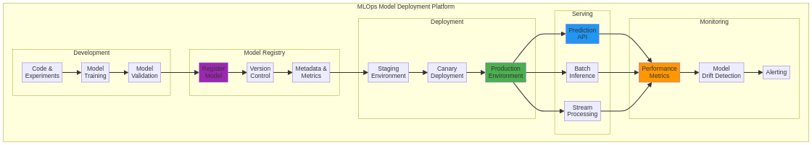

# MLOps Model Deployment Platform


Este projeto pode ser visualizado e interagido através do GitHub Pages: [https://gabrieldemetrioslafis.github.io/mlops-model-deployment-platform/](https://gabrieldemetrioslafis.github.io/mlops-model-deployment-platform/)

This project can be viewed and interacted with via GitHub Pages: [https://gabrieldemetrioslafis.github.io/mlops-model-deployment-platform/](https://gabrieldemetrioslafis.github.io/mlops-model-deployment-platform/)

---

## 🇧🇷 Plataforma de Deploy de Modelos MLOps

Este repositório apresenta uma **plataforma completa para o deploy e gerenciamento de modelos de Machine Learning (ML) em produção**, seguindo as melhores práticas de MLOps. O foco é em automatizar o ciclo de vida do modelo, desde o treinamento e versionamento até a implantação, monitoramento e retreinamento, garantindo **escalabilidade, confiabilidade e reprodutibilidade** em ambientes de produção.

### 🎯 Objetivo

O principal objetivo deste projeto é **fornecer um guia detalhado e exemplos de código funcional** para engenheiros de ML, cientistas de dados e arquitetos que buscam construir ou otimizar suas pipelines de MLOps. Serão abordados os conceitos fundamentais, ferramentas e tecnologias para criar uma plataforma robusta de deploy de modelos.

### ✨ Destaques

- **Automação Completa**: Pipelines CI/CD para automatizar o treinamento, versionamento, teste e deploy de modelos.
- **Gerenciamento de Modelos**: Utilização de ferramentas para rastrear experimentos, registrar modelos e gerenciar metadados.
- **Escalabilidade e Resiliência**: Implementação de soluções que garantem que os modelos possam lidar com cargas de trabalho variáveis e sejam tolerantes a falhas.
- **Monitoramento Contínuo**: Ferramentas para monitorar a performance do modelo em produção, detectar *drift* de dados e de modelo, e acionar retreinamentos.
- **Código Profissional**: Exemplos de código bem estruturados, seguindo as melhores práticas da indústria, com foco em modularidade, reusabilidade e manutenibilidade.
- **Documentação Completa**: Cada componente da plataforma é acompanhado de documentação detalhada, diagramas explicativos e casos de uso práticos.
- **Testes Incluídos**: Módulos de código validados através de testes unitários e de integração, garantindo a robustez e a confiabilidade das soluções.
- **Abordagem Didática**: Conteúdo apresentado de forma didática, ideal para aprendizado e referência, com explicações claras sobre os conceitos e a aplicação prática.

### 📊 Visualização



*Diagrama ilustrativo da arquitetura da plataforma MLOps, destacando os principais componentes e o fluxo de trabalho.*

---

## 🇬🇧 MLOps Model Deployment Platform

This repository presents a **complete platform for deploying and managing Machine Learning (ML) models in production**, following MLOps best practices. The focus is on automating the model lifecycle, from training and versioning to deployment, monitoring, and retraining, ensuring **scalability, reliability, and reproducibility** in production environments.

### 🎯 Objective

The main objective of this project is to **provide a detailed guide and functional code examples** for ML engineers, data scientists, and architects looking to build or optimize their MLOps pipelines. It will cover fundamental concepts, tools, and technologies to create a robust model deployment platform.

### ✨ Highlights

- **Full Automation**: CI/CD pipelines to automate model training, versioning, testing, and deployment.
- **Model Management**: Use of tools to track experiments, register models, and manage metadata.
- **Scalability and Resilience**: Implementation of solutions that ensure models can handle varying workloads and are fault-tolerant.
- **Continuous Monitoring**: Tools to monitor model performance in production, detect data and model drift, and trigger retraining.
- **Professional Code**: Well-structured code examples, following industry best practices, with a focus on modularity, reusability, and maintainability.
- **Complete Documentation**: Each platform component is accompanied by detailed documentation, explanatory diagrams, and practical use cases.
- **Tests Included**: Code modules validated through unit and integration tests, ensuring the robustness and reliability of the solutions.
- **Didactic Approach**: Content presented didactically, ideal for learning and reference, with clear explanations of concepts and practical application.

### 📊 Visualization


*Illustrative diagram of the MLOps platform architecture, highlighting key components and workflow.*

---

## 📁 Repository Structure

```
mlops-model-deployment-platform/
├── src/           # Código fonte e exemplos de implementação da plataforma MLOps
├── data/          # Dados de exemplo e datasets para treinamento e teste
├── images/        # Imagens e diagramas para o README e documentação
├── tests/         # Testes unitários e de integração para os componentes da plataforma
├── docs/          # Documentação adicional, guias e whitepapers sobre MLOps
└── scripts/       # Scripts utilitários para automação, deploy e gerenciamento
```

---

## 🚀 Getting Started

Para começar, clone o repositório e explore os diretórios `src/` e `docs/` para exemplos detalhados e instruções de uso. Certifique-se de ter as dependências necessárias instaladas (Python, Docker, Kubernetes, MLflow, etc.).

```bash
git clone https://github.com/GabrielDemetriosLafis/mlops-model-deployment-platform.git
cd mlops-model-deployment-platform
# Siga as instruções específicas em src/ e docs/
```

---

## 🤝 Contribuição

Contribuições são bem-vindas! Sinta-se à vontade para abrir issues, enviar pull requests ou sugerir melhorias. Por favor, siga as diretrizes de contribuição.

---

## 📝 Licença

Este projeto está licenciado sob a Licença MIT - veja o arquivo [LICENSE](LICENSE) para detalhes.

---

**Autor:** Gabriel Demetrios Lafis  
**Ano:** 2025

