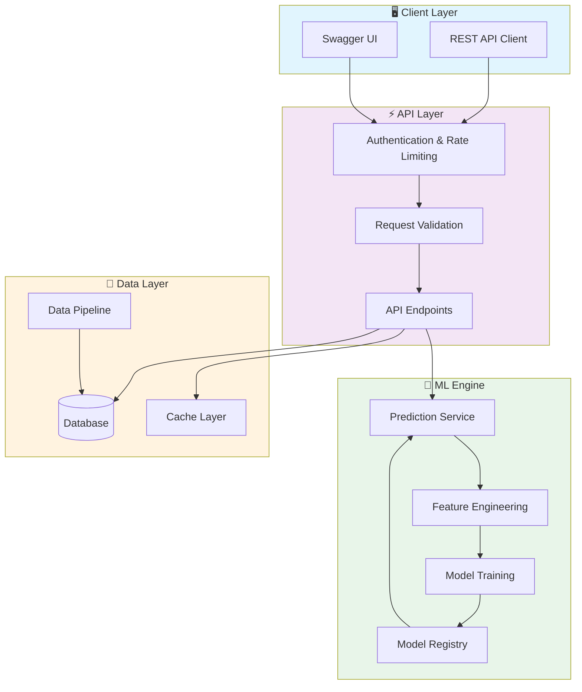
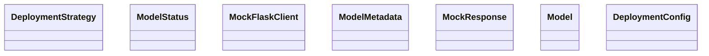

# 🤖 Mlops Model Deployment Platform

> MLOps platform for end-to-end model lifecycle management. Handles versioning, A/B testing, canary deployments, monitoring, and automated retraining.

[](https://img.shields.io/badge/)
[](https://img.shields.io/badge/)
[](https://img.shields.io/badge/)
[](https://img.shields.io/badge/)
[](https://img.shields.io/badge/)
[](LICENSE)

[English](#english) | [Português](#português)

---

## English

### 🎯 Overview

**Mlops Model Deployment Platform** is a production-grade Python application that showcases modern software engineering practices including clean architecture, comprehensive testing, containerized deployment, and CI/CD readiness.

The codebase comprises **1,768 lines** of source code organized across **8 modules**, following industry best practices for maintainability, scalability, and code quality.

### ✨ Key Features

- **🤖 ML Pipeline**: End-to-end machine learning workflow from data to deployment
- **🔬 Feature Engineering**: Automated feature extraction and transformation
- **📊 Model Evaluation**: Comprehensive metrics and cross-validation
- **🚀 Model Serving**: Production-ready prediction API
- **🏗️ Object-Oriented**: 9 core classes with clean architecture

### 🏗️ Architecture


```mermaid
graph TB
    subgraph Client["🖥️ Client Layer"]
        A[REST API Client]
        B[Swagger UI]
    end
    
    subgraph API["⚡ API Layer"]
        C[Authentication & Rate Limiting]
        D[Request Validation]
        E[API Endpoints]
    end
    
    subgraph ML["🤖 ML Engine"]
        F[Feature Engineering]
        G[Model Training]
        H[Prediction Service]
        I[Model Registry]
    end
    
    subgraph Data["💾 Data Layer"]
        J[(Database)]
        K[Cache Layer]
        L[Data Pipeline]
    end
    
    A --> C
    B --> C
    C --> D --> E
    E --> H
    E --> J
    H --> F --> G
    G --> I
    I --> H
    E --> K
    L --> J
    
    style Client fill:#e1f5fe
    style API fill:#f3e5f5
    style ML fill:#e8f5e9
    style Data fill:#fff3e0
```


```mermaid
classDiagram
    class DeploymentStrategy
    class ModelStatus
    class MockFlaskClient
    class ModelMetadata
    class MockResponse
    class Model
    class DeploymentConfig
```

### 🚀 Quick Start

#### Prerequisites

- Python 3.12+
- pip (Python package manager)

#### Installation

```bash
# Clone the repository
git clone https://github.com/galafis/mlops-model-deployment-platform.git
cd mlops-model-deployment-platform

# Create and activate virtual environment
python -m venv venv
source venv/bin/activate  # On Windows: venv\Scripts\activate

# Install dependencies
pip install -r requirements.txt
```

#### Running

```bash
# Run the application
python src/main.py
```

### 🧪 Testing

```bash
# Run all tests
pytest

# Run with coverage report
pytest --cov --cov-report=html

# Run specific test module
pytest tests/test_main.py -v

# Run with detailed output
pytest -v --tb=short
```

### 📁 Project Structure

```
mlops-model-deployment-platform/
├── diagrams/
├── examples/
│   ├── README.md
│   └── simple_example.py
├── images/
├── src/          # Source code
│   ├── __init__.py
│   ├── advanced_example.py
│   ├── model_deployment.py
│   └── model_serving_api.py
├── tests/         # Test suite
│   ├── test_integration.py
│   └── test_model_deployment.py
├── API_DOCUMENTATION.md
├── CONTRIBUTING.md
├── LICENSE
├── README.md
├── requirements.txt
└── setup.py
```

### 🛠️ Tech Stack

| Technology | Description | Role |
|------------|-------------|------|
| **Python** | Core Language | Primary |
| **Flask** | Lightweight web framework | Framework |
| **Gin** | Go web framework | Framework |
| **Pandas** | Data manipulation library | Framework |
| **scikit-learn** | Machine learning library | Framework |

### 🤝 Contributing

Contributions are welcome! Please feel free to submit a Pull Request. For major changes, please open an issue first to discuss what you would like to change.

1. Fork the project
2. Create your feature branch (`git checkout -b feature/AmazingFeature`)
3. Commit your changes (`git commit -m 'Add some AmazingFeature'`)
4. Push to the branch (`git push origin feature/AmazingFeature`)
5. Open a Pull Request

### 📄 License

This project is licensed under the MIT License - see the [LICENSE](LICENSE) file for details.

### 👤 Author

**Gabriel Demetrios Lafis**
- GitHub: [@galafis](https://github.com/galafis)
- LinkedIn: [Gabriel Demetrios Lafis](https://linkedin.com/in/gabriel-demetrios-lafis)

---

## Português

### 🎯 Visão Geral

**Mlops Model Deployment Platform** é uma aplicação Python de nível profissional que demonstra práticas modernas de engenharia de software, incluindo arquitetura limpa, testes abrangentes, implantação containerizada e prontidão para CI/CD.

A base de código compreende **1,768 linhas** de código-fonte organizadas em **8 módulos**, seguindo as melhores práticas do setor para manutenibilidade, escalabilidade e qualidade de código.

### ✨ Funcionalidades Principais

- **🤖 ML Pipeline**: End-to-end machine learning workflow from data to deployment
- **🔬 Feature Engineering**: Automated feature extraction and transformation
- **📊 Model Evaluation**: Comprehensive metrics and cross-validation
- **🚀 Model Serving**: Production-ready prediction API
- **🏗️ Object-Oriented**: 9 core classes with clean architecture

### 🏗️ Arquitetura


```mermaid
graph TB
    subgraph Client["🖥️ Client Layer"]
        A[REST API Client]
        B[Swagger UI]
    end
    
    subgraph API["⚡ API Layer"]
        C[Authentication & Rate Limiting]
        D[Request Validation]
        E[API Endpoints]
    end
    
    subgraph ML["🤖 ML Engine"]
        F[Feature Engineering]
        G[Model Training]
        H[Prediction Service]
        I[Model Registry]
    end
    
    subgraph Data["💾 Data Layer"]
        J[(Database)]
        K[Cache Layer]
        L[Data Pipeline]
    end
    
    A --> C
    B --> C
    C --> D --> E
    E --> H
    E --> J
    H --> F --> G
    G --> I
    I --> H
    E --> K
    L --> J
    
    style Client fill:#e1f5fe
    style API fill:#f3e5f5
    style ML fill:#e8f5e9
    style Data fill:#fff3e0
```

### 🚀 Início Rápido

#### Prerequisites

- Python 3.12+
- pip (Python package manager)

#### Installation

```bash
# Clone the repository
git clone https://github.com/galafis/mlops-model-deployment-platform.git
cd mlops-model-deployment-platform

# Create and activate virtual environment
python -m venv venv
source venv/bin/activate  # On Windows: venv\Scripts\activate

# Install dependencies
pip install -r requirements.txt
```

#### Running

```bash
# Run the application
python src/main.py
```

### 🧪 Testing

```bash
# Run all tests
pytest

# Run with coverage report
pytest --cov --cov-report=html

# Run specific test module
pytest tests/test_main.py -v

# Run with detailed output
pytest -v --tb=short
```

### 📁 Estrutura do Projeto

```
mlops-model-deployment-platform/
├── diagrams/
├── examples/
│   ├── README.md
│   └── simple_example.py
├── images/
├── src/          # Source code
│   ├── __init__.py
│   ├── advanced_example.py
│   ├── model_deployment.py
│   └── model_serving_api.py
├── tests/         # Test suite
│   ├── test_integration.py
│   └── test_model_deployment.py
├── API_DOCUMENTATION.md
├── CONTRIBUTING.md
├── LICENSE
├── README.md
├── requirements.txt
└── setup.py
```

### 🛠️ Stack Tecnológica

| Tecnologia | Descrição | Papel |
|------------|-----------|-------|
| **Python** | Core Language | Primary |
| **Flask** | Lightweight web framework | Framework |
| **Gin** | Go web framework | Framework |
| **Pandas** | Data manipulation library | Framework |
| **scikit-learn** | Machine learning library | Framework |

### 🤝 Contribuindo

Contribuições são bem-vindas! Sinta-se à vontade para enviar um Pull Request.

### 📄 Licença

Este projeto está licenciado sob a Licença MIT - veja o arquivo [LICENSE](LICENSE) para detalhes.

### 👤 Autor

**Gabriel Demetrios Lafis**
- GitHub: [@galafis](https://github.com/galafis)
- LinkedIn: [Gabriel Demetrios Lafis](https://linkedin.com/in/gabriel-demetrios-lafis)
