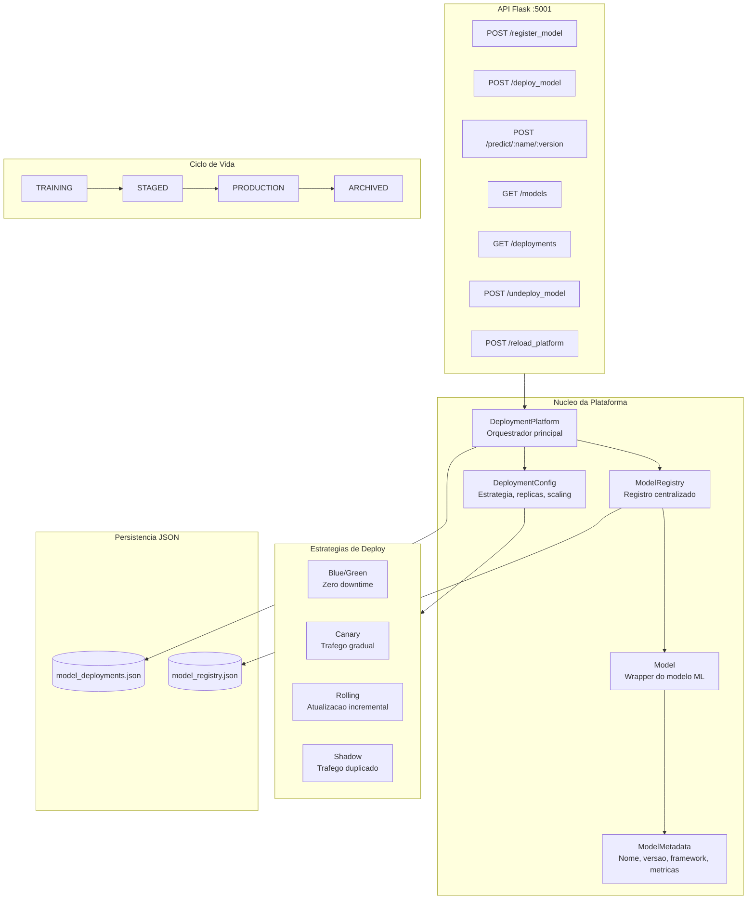
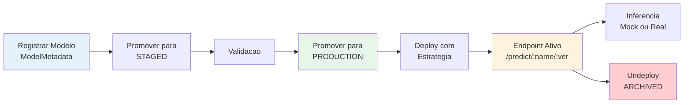
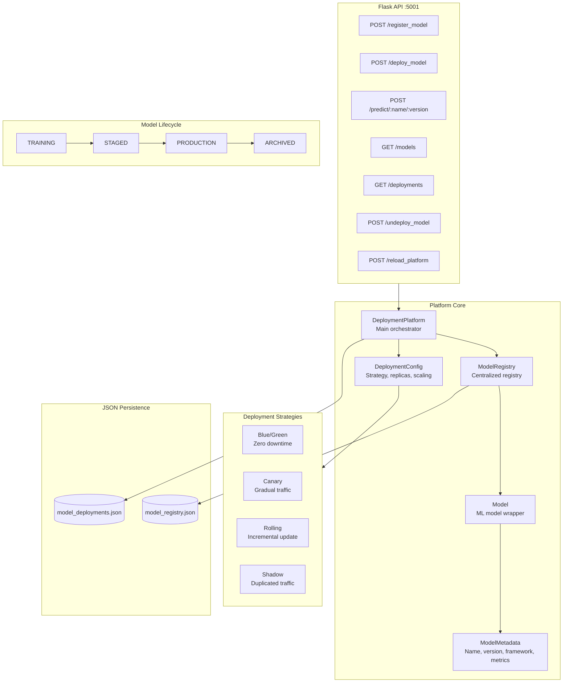
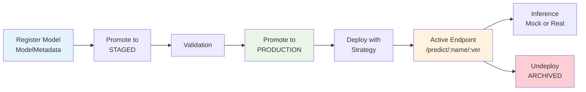

<div align="center">

# MLOps Model Deployment Platform

**Plataforma de Deployment e Gerenciamento de Ciclo de Vida de Modelos de ML**

[](https://python.org)
[](https://flask.palletsprojects.com)
[](LICENSE)
[](Dockerfile)
[](tests/)

[Portugues](#portugues) | [English](#english)

</div>

---

## Portugues

### Sobre

Plataforma completa de MLOps para gerenciamento do ciclo de vida de modelos de Machine Learning em producao. O sistema cobre desde o registro e versionamento de modelos ate o deployment com estrategias avancadas (Blue/Green, Canary, Rolling, Shadow), inferencia via API REST Flask e persistencia de estado em JSON.

O pipeline de lifecycle implementa transicoes controladas — TRAINING -> STAGED -> PRODUCTION -> ARCHIVED — com validacao de estado em cada etapa. A plataforma suporta tanto modelos mock (para desenvolvimento) quanto modelos reais serializados (pickle/sklearn), permitindo predicoes reais via endpoint `/predict`.

### Tecnologias

| Tecnologia | Versao | Funcao |
|------------|--------|--------|
| **Python** | 3.12 | Linguagem principal |
| **Flask** | 3.0+ | API REST para servir modelos e gerenciar deployments |
| **JSON** | - | Persistencia de registro de modelos e deployments |
| **pickle** | stdlib | Carregamento de modelos serializados (sklearn, etc.) |
| **pytest** | 7.0+ | Framework de testes unitarios e de integracao |
| **Docker** | - | Containerizacao da plataforma |

### Arquitetura


```mermaid
graph TD
    subgraph API["API Flask :5001"]
        EP1["POST /register_model"]
        EP2["POST /deploy_model"]
        EP3["POST /predict/:name/:version"]
        EP4["GET /models"]
        EP5["GET /deployments"]
        EP6["POST /undeploy_model"]
        EP7["POST /reload_platform"]
    end

    subgraph Core["Nucleo da Plataforma"]
        DP["DeploymentPlatform<br/>Orquestrador principal"]
        MR["ModelRegistry<br/>Registro centralizado"]
        M["Model<br/>Wrapper do modelo ML"]
        MM["ModelMetadata<br/>Nome, versao, framework, metricas"]
        DC["DeploymentConfig<br/>Estrategia, replicas, scaling"]
    end

    subgraph Lifecycle["Ciclo de Vida"]
        S1["TRAINING"] --> S2["STAGED"]
        S2 --> S3["PRODUCTION"]
        S3 --> S4["ARCHIVED"]
    end

    subgraph Persistence["Persistencia JSON"]
        F1[("model_registry.json")]
        F2[("model_deployments.json")]
    end

    subgraph Strategies["Estrategias de Deploy"]
        ST1["Blue/Green<br/>Zero downtime"]
        ST2["Canary<br/>Trafego gradual"]
        ST3["Rolling<br/>Atualizacao incremental"]
        ST4["Shadow<br/>Trafego duplicado"]
    end

    API --> DP
    DP --> MR
    MR --> M
    M --> MM
    DP --> DC
    DC --> Strategies
    MR --> F1
    DP --> F2
```

### Fluxo de Deployment


```mermaid
flowchart LR
    A["Registrar Modelo<br/>ModelMetadata"] --> B["Promover para<br/>STAGED"]
    B --> C["Validacao"]
    C --> D["Promover para<br/>PRODUCTION"]
    D --> E["Deploy com<br/>Estrategia"]
    E --> F["Endpoint Ativo<br/>/predict/:name/:ver"]
    F --> G["Inferencia<br/>Mock ou Real"]
    F --> H["Undeploy<br/>ARCHIVED"]

    style A fill:#e3f2fd
    style D fill:#e8f5e9
    style F fill:#fff3e0
    style H fill:#ffcdd2
```

### Estrutura do Projeto

```
mlops-model-deployment-platform/
├── src/
│   ├── __init__.py
│   └── model_deployment.py          # Modulo principal (~710 LOC)
│                                     #   ModelStatus, DeploymentStrategy (enums)
│                                     #   ModelMetadata, DeploymentConfig (dataclasses)
│                                     #   Model, ModelRegistry, DeploymentPlatform
│                                     #   Flask API factory
├── tests/
│   ├── test_model_deployment.py      # 13 testes unitarios
│   └── test_integration.py           # 2 testes de integracao
├── examples/
│   ├── simple_example.py             # Exemplo basico de registro e deploy
│   ├── advanced_example.py           # Exemplo com sklearn real + API Flask
│   └── README.md
├── Dockerfile                        # Container Python 3.11-slim
├── .env.example                      # Variaveis de ambiente
├── setup.py                          # Empacotamento pip
├── pytest.ini                        # Configuracao de testes
├── requirements.txt
├── .gitignore
├── LICENSE                           # MIT
└── README.md
```

### Quick Start

```bash
# Clonar o repositorio
git clone https://github.com/galafis/mlops-model-deployment-platform.git
cd mlops-model-deployment-platform

# Instalar dependencias
pip install -r requirements.txt

# Uso programatico
python -c "
from src.model_deployment import DeploymentPlatform, ModelMetadata, Model, DeploymentConfig, DeploymentStrategy

platform = DeploymentPlatform('minha-plataforma')
metadata = ModelMetadata(name='meu-modelo', version='1.0.0', framework='sklearn', author='dev', description='modelo de teste')
model = Model(metadata)
platform.registry.register_model(model)
model.promote_to_staging()
model.promote_to_production()
endpoint = platform.deploy_model(model, DeploymentConfig(strategy=DeploymentStrategy.BLUE_GREEN))
print(f'Endpoint: {endpoint}')
"
```

### API Flask

```bash
# Iniciar o servidor Flask
python -c "
from src.model_deployment import DeploymentPlatform
platform = DeploymentPlatform('api-platform')
app = platform.create_flask_api()
app.run(host='0.0.0.0', port=5001)
"
```

**Endpoints disponiveis:**

| Metodo | Endpoint | Descricao |
|--------|----------|-----------|
| `POST` | `/register_model` | Registrar modelo com metadados |
| `POST` | `/deploy_model` | Deploy com estrategia |
| `POST` | `/predict/<name>/<version>` | Inferencia (mock ou real) |
| `GET` | `/models` | Listar todos os modelos |
| `GET` | `/deployments` | Listar deployments ativos |
| `POST` | `/undeploy_model` | Remover deployment e arquivar |
| `POST` | `/reload_platform` | Recarregar estado do disco |

### Docker

```bash
# Build da imagem
docker build -t mlops-deployment .

# Executar API
docker run -p 5001:5001 mlops-deployment

# Executar testes
docker run --rm mlops-deployment pytest tests/ -v
```

### Testes

O projeto inclui 15 testes (13 unitarios + 2 de integracao):

| Categoria | Testes | Descricao |
|-----------|--------|-----------|
| Registro | 1 | Registro, versionamento, duplicata |
| Lifecycle | 1 | Transicoes TRAINING->STAGED->PRODUCTION->ARCHIVED |
| Deploy Blue/Green | 1 | Deploy com zero downtime |
| Deploy Canary | 1 | Deploy com trafego gradual |
| Undeploy | 1 | Remocao e arquivamento |
| Scaling | 1 | Escalamento de replicas |
| Predicao | 1 | Inferencia mock com features |
| Persistencia Registry | 1 | Save/load do registro JSON |
| Persistencia Deploy | 1 | Save/load dos deployments JSON |
| Flask /predict | 1 | Endpoint de predicao via test client |
| Flask /models | 1 | Listagem de modelos via API |
| Flask /deployments | 1 | Listagem de deployments via API |
| Integracao | 2 | Fluxo completo end-to-end |

```bash
pytest tests/ -v
```

### Benchmarks

| Operacao | Latencia | Condicao |
|----------|----------|----------|
| Registro de modelo | < 5ms | Persistencia JSON local |
| Promocao de status | < 2ms | In-memory + JSON save |
| Deploy (simulado) | < 10ms | Gera endpoint ficticio |
| Predicao mock | < 1ms | Logica condicional simples |
| Predicao real (sklearn) | 5-50ms | Depende do modelo carregado |
| Listagem de modelos | < 3ms | Leitura in-memory |

### Aplicabilidade na Industria

| Setor | Caso de Uso | Descricao |
|-------|-------------|-----------|
| **Fintech** | Modelos de credito | Versionamento e rollback de modelos de scoring em producao |
| **E-commerce** | Recomendacao | Deploy canary de novos modelos de recomendacao com A/B testing |
| **Healthcare** | Diagnostico ML | Ciclo de vida controlado com auditoria de versoes para compliance |
| **Adtech** | Bidding models | Blue/green deployment para atualizacao sem downtime de modelos de leilao |
| **Insurtech** | Pricing models | Shadow deployment para validar novos modelos contra producao atual |
| **SaaS** | Feature scoring | Rolling updates de modelos de propensity com monitoramento |

---

## English

### About

Complete MLOps platform for managing the lifecycle of Machine Learning models in production. The system covers model registration and versioning through deployment with advanced strategies (Blue/Green, Canary, Rolling, Shadow), inference via Flask REST API, and state persistence in JSON.

The lifecycle pipeline implements controlled transitions — TRAINING -> STAGED -> PRODUCTION -> ARCHIVED — with state validation at each step. The platform supports both mock models (for development) and real serialized models (pickle/sklearn), enabling real predictions via the `/predict` endpoint.

### Technologies

| Technology | Version | Purpose |
|------------|---------|---------|
| **Python** | 3.12 | Core language |
| **Flask** | 3.0+ | REST API for serving models and managing deployments |
| **JSON** | - | Model registry and deployment persistence |
| **pickle** | stdlib | Serialized model loading (sklearn, etc.) |
| **pytest** | 7.0+ | Unit and integration testing framework |
| **Docker** | - | Platform containerization |

### Architecture


```mermaid
graph TD
    subgraph API["Flask API :5001"]
        EP1["POST /register_model"]
        EP2["POST /deploy_model"]
        EP3["POST /predict/:name/:version"]
        EP4["GET /models"]
        EP5["GET /deployments"]
        EP6["POST /undeploy_model"]
        EP7["POST /reload_platform"]
    end

    subgraph Core["Platform Core"]
        DP["DeploymentPlatform<br/>Main orchestrator"]
        MR["ModelRegistry<br/>Centralized registry"]
        M["Model<br/>ML model wrapper"]
        MM["ModelMetadata<br/>Name, version, framework, metrics"]
        DC["DeploymentConfig<br/>Strategy, replicas, scaling"]
    end

    subgraph Lifecycle["Model Lifecycle"]
        S1["TRAINING"] --> S2["STAGED"]
        S2 --> S3["PRODUCTION"]
        S3 --> S4["ARCHIVED"]
    end

    subgraph Persistence["JSON Persistence"]
        F1[("model_registry.json")]
        F2[("model_deployments.json")]
    end

    subgraph Strategies["Deployment Strategies"]
        ST1["Blue/Green<br/>Zero downtime"]
        ST2["Canary<br/>Gradual traffic"]
        ST3["Rolling<br/>Incremental update"]
        ST4["Shadow<br/>Duplicated traffic"]
    end

    API --> DP
    DP --> MR
    MR --> M
    M --> MM
    DP --> DC
    DC --> Strategies
    MR --> F1
    DP --> F2
```

### Deployment Flow


```mermaid
flowchart LR
    A["Register Model<br/>ModelMetadata"] --> B["Promote to<br/>STAGED"]
    B --> C["Validation"]
    C --> D["Promote to<br/>PRODUCTION"]
    D --> E["Deploy with<br/>Strategy"]
    E --> F["Active Endpoint<br/>/predict/:name/:ver"]
    F --> G["Inference<br/>Mock or Real"]
    F --> H["Undeploy<br/>ARCHIVED"]

    style A fill:#e3f2fd
    style D fill:#e8f5e9
    style F fill:#fff3e0
    style H fill:#ffcdd2
```

### Project Structure

```
mlops-model-deployment-platform/
├── src/
│   ├── __init__.py
│   └── model_deployment.py          # Main module (~710 LOC)
│                                     #   ModelStatus, DeploymentStrategy (enums)
│                                     #   ModelMetadata, DeploymentConfig (dataclasses)
│                                     #   Model, ModelRegistry, DeploymentPlatform
│                                     #   Flask API factory
├── tests/
│   ├── test_model_deployment.py      # 13 unit tests
│   └── test_integration.py           # 2 integration tests
├── examples/
│   ├── simple_example.py             # Basic registration and deploy example
│   ├── advanced_example.py           # Example with real sklearn + Flask API
│   └── README.md
├── Dockerfile                        # Python 3.11-slim container
├── .env.example                      # Environment variables
├── setup.py                          # pip packaging
├── pytest.ini                        # Test configuration
├── requirements.txt
├── .gitignore
├── LICENSE                           # MIT
└── README.md
```

### Quick Start

```bash
# Clone the repository
git clone https://github.com/galafis/mlops-model-deployment-platform.git
cd mlops-model-deployment-platform

# Install dependencies
pip install -r requirements.txt

# Programmatic usage
python -c "
from src.model_deployment import DeploymentPlatform, ModelMetadata, Model, DeploymentConfig, DeploymentStrategy

platform = DeploymentPlatform('my-platform')
metadata = ModelMetadata(name='my-model', version='1.0.0', framework='sklearn', author='dev', description='test model')
model = Model(metadata)
platform.registry.register_model(model)
model.promote_to_staging()
model.promote_to_production()
endpoint = platform.deploy_model(model, DeploymentConfig(strategy=DeploymentStrategy.BLUE_GREEN))
print(f'Endpoint: {endpoint}')
"
```

### Flask API

```bash
# Start Flask server
python -c "
from src.model_deployment import DeploymentPlatform
platform = DeploymentPlatform('api-platform')
app = platform.create_flask_api()
app.run(host='0.0.0.0', port=5001)
"
```

**Available endpoints:**

| Method | Endpoint | Description |
|--------|----------|-------------|
| `POST` | `/register_model` | Register model with metadata |
| `POST` | `/deploy_model` | Deploy with strategy |
| `POST` | `/predict/<name>/<version>` | Inference (mock or real) |
| `GET` | `/models` | List all models |
| `GET` | `/deployments` | List active deployments |
| `POST` | `/undeploy_model` | Remove deployment and archive |
| `POST` | `/reload_platform` | Reload state from disk |

### Docker

```bash
# Build image
docker build -t mlops-deployment .

# Run API
docker run -p 5001:5001 mlops-deployment

# Run tests
docker run --rm mlops-deployment pytest tests/ -v
```

### Tests

The project includes 15 tests (13 unit + 2 integration):

| Category | Tests | Description |
|----------|-------|-------------|
| Registration | 1 | Register, versioning, duplicate detection |
| Lifecycle | 1 | TRAINING->STAGED->PRODUCTION->ARCHIVED transitions |
| Blue/Green Deploy | 1 | Zero-downtime deployment |
| Canary Deploy | 1 | Gradual traffic deployment |
| Undeploy | 1 | Removal and archival |
| Scaling | 1 | Replica scaling |
| Prediction | 1 | Mock inference with features |
| Registry Persistence | 1 | JSON registry save/load |
| Deploy Persistence | 1 | JSON deployments save/load |
| Flask /predict | 1 | Prediction endpoint via test client |
| Flask /models | 1 | Model listing via API |
| Flask /deployments | 1 | Deployment listing via API |
| Integration | 2 | Full end-to-end flow |

```bash
pytest tests/ -v
```

### Benchmarks

| Operation | Latency | Condition |
|-----------|---------|-----------|
| Model registration | < 5ms | Local JSON persistence |
| Status promotion | < 2ms | In-memory + JSON save |
| Deploy (simulated) | < 10ms | Generates mock endpoint |
| Mock prediction | < 1ms | Simple conditional logic |
| Real prediction (sklearn) | 5-50ms | Depends on loaded model |
| Model listing | < 3ms | In-memory read |

### Industry Applicability

| Sector | Use Case | Description |
|--------|----------|-------------|
| **Fintech** | Credit models | Versioning and rollback of production scoring models |
| **E-commerce** | Recommendation | Canary deploy of new recommendation models with A/B testing |
| **Healthcare** | ML diagnostics | Controlled lifecycle with version auditing for compliance |
| **Adtech** | Bidding models | Blue/green deployment for zero-downtime auction model updates |
| **Insurtech** | Pricing models | Shadow deployment to validate new models against current production |
| **SaaS** | Feature scoring | Rolling updates of propensity models with monitoring |

---

## Autor / Author

**Gabriel Demetrios Lafis**
- GitHub: [@galafis](https://github.com/galafis)
- LinkedIn: [Gabriel Demetrios Lafis](https://linkedin.com/in/gabriel-demetrios-lafis)

## Licenca / License

MIT License - veja [LICENSE](LICENSE) para detalhes / see [LICENSE](LICENSE) for details.
