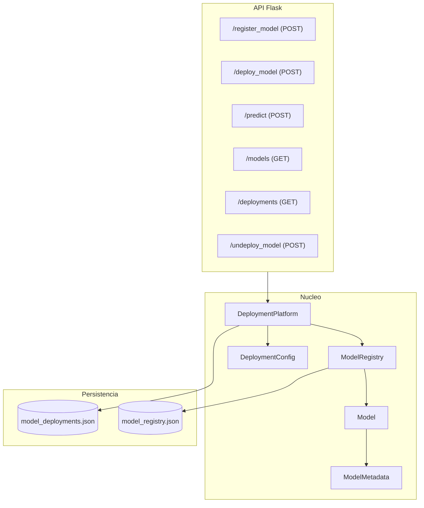

# MLOps Model Deployment Platform

Plataforma para gerenciamento de ciclo de vida de modelos de ML com persistencia JSON e API Flask.

[](https://python.org)
[](https://flask.palletsprojects.com)
[](LICENSE)
[](Dockerfile)

[English](#english) | [Portugues](#portugues)

---

## Portugues

### Visao Geral

Plataforma de deployment de modelos de Machine Learning que gerencia o ciclo de vida completo: registro, versionamento, promocao (training -> staged -> production -> archived), deployment simulado com estrategias (blue/green, canary, rolling, shadow), e API REST para inferencia.

Os dados sao persistidos em arquivos JSON locais (`model_registry.json`, `model_deployments.json`). O deployment e simulado — gera URLs de endpoint ficticias, sem provisionamento real de infraestrutura.

### Arquitetura


```mermaid
graph TB
    subgraph API["API Flask"]
        A["/register_model (POST)"]
        B["/deploy_model (POST)"]
        C["/predict (POST)"]
        D["/models (GET)"]
        E["/deployments (GET)"]
        F["/undeploy_model (POST)"]
    end

    subgraph Core["Nucleo"]
        G[DeploymentPlatform]
        H[ModelRegistry]
        I[Model]
        J[ModelMetadata]
        K[DeploymentConfig]
    end

    subgraph Persistencia["Persistencia"]
        L[(model_registry.json)]
        M[(model_deployments.json)]
    end

    API --> G
    G --> H
    H --> I
    I --> J
    G --> K
    H --> L
    G --> M
```

### Funcionalidades

- **Registro de modelos** com metadados (nome, versao, framework, autor, metricas)
- **Versionamento** — multiplas versoes do mesmo modelo
- **Ciclo de vida** — transicoes: TRAINING -> STAGED -> PRODUCTION -> ARCHIVED
- **Estrategias de deployment** — Blue/Green, Canary (com % de trafego), Rolling, Shadow
- **Persistencia JSON** — registro e deployments salvos em disco
- **API REST Flask** — endpoints para CRUD de modelos e inferencia
- **Predicao mock** — se nenhum modelo real (pickle) for carregado, retorna predicao simulada
- **Predicao real** — carrega modelos pickle (sklearn, etc.) e chama `.predict()`

### Como Executar

```bash
# Instalar dependencias
pip install -r requirements.txt

# Usar programaticamente
python -c "
from src.model_deployment import DeploymentPlatform, ModelMetadata, Model, DeploymentConfig, DeploymentStrategy

platform = DeploymentPlatform('minha-plataforma')
metadata = ModelMetadata(name='meu-modelo', version='1.0.0', framework='sklearn', author='eu', description='teste')
model = Model(metadata)
platform.registry.register_model(model)
model.promote_to_staging()
model.promote_to_production()
endpoint = platform.deploy_model(model, DeploymentConfig(strategy=DeploymentStrategy.BLUE_GREEN))
print(f'Endpoint: {endpoint}')
"

# Iniciar API Flask
python -c "
from src.model_deployment import DeploymentPlatform
platform = DeploymentPlatform('api-platform')
app = platform.create_flask_api()
app.run(host='0.0.0.0', port=5001)
"

# Executar exemplo avancado (requer: pip install pandas scikit-learn requests numpy)
python examples/advanced_example.py

# Executar testes
pytest tests/ -v
```

### Estrutura do Projeto

```
mlops-model-deployment-platform/
├── src/
│   ├── __init__.py
│   └── model_deployment.py    # Modulo principal (~709 linhas)
├── tests/
│   ├── test_model_deployment.py  # 13 testes unitarios
│   └── test_integration.py       # 2 testes de integracao
├── examples/
│   ├── simple_example.py         # Exemplo basico
│   ├── advanced_example.py       # Exemplo com sklearn + API
│   └── README.md
├── LICENSE
├── README.md
├── requirements.txt
└── setup.py
```

### Tecnologias

| Tecnologia | Uso |
|------------|-----|
| Python | Linguagem principal |
| Flask | API REST |
| JSON | Persistencia de dados |
| pickle | Carregamento de modelos serializados |

---

## English

### Overview

Machine Learning model deployment platform that manages the full lifecycle: registration, versioning, promotion (training -> staged -> production -> archived), simulated deployment with strategies (blue/green, canary, rolling, shadow), and REST API for inference.

Data is persisted in local JSON files (`model_registry.json`, `model_deployments.json`). Deployment is simulated — generates fake endpoint URLs without actual infrastructure provisioning.

### Architecture


```mermaid
graph TB
    subgraph API["Flask API"]
        A["/register_model (POST)"]
        B["/deploy_model (POST)"]
        C["/predict (POST)"]
        D["/models (GET)"]
        E["/deployments (GET)"]
        F["/undeploy_model (POST)"]
    end

    subgraph Core["Core"]
        G[DeploymentPlatform]
        H[ModelRegistry]
        I[Model]
        J[ModelMetadata]
        K[DeploymentConfig]
    end

    subgraph Storage["Storage"]
        L[(model_registry.json)]
        M[(model_deployments.json)]
    end

    API --> G
    G --> H
    H --> I
    I --> J
    G --> K
    H --> L
    G --> M
```

### Features

- **Model registration** with metadata (name, version, framework, author, metrics)
- **Versioning** — multiple versions of the same model
- **Lifecycle management** — transitions: TRAINING -> STAGED -> PRODUCTION -> ARCHIVED
- **Deployment strategies** — Blue/Green, Canary (with traffic %), Rolling, Shadow
- **JSON persistence** — registry and deployments saved to disk
- **Flask REST API** — endpoints for model CRUD and inference
- **Mock prediction** — if no real model (pickle) is loaded, returns simulated prediction
- **Real prediction** — loads pickle models (sklearn, etc.) and calls `.predict()`

### How to Run

```bash
# Install dependencies
pip install -r requirements.txt

# Use programmatically
python -c "
from src.model_deployment import DeploymentPlatform, ModelMetadata, Model, DeploymentConfig, DeploymentStrategy

platform = DeploymentPlatform('my-platform')
metadata = ModelMetadata(name='my-model', version='1.0.0', framework='sklearn', author='me', description='test')
model = Model(metadata)
platform.registry.register_model(model)
model.promote_to_staging()
model.promote_to_production()
endpoint = platform.deploy_model(model, DeploymentConfig(strategy=DeploymentStrategy.BLUE_GREEN))
print(f'Endpoint: {endpoint}')
"

# Start Flask API
python -c "
from src.model_deployment import DeploymentPlatform
platform = DeploymentPlatform('api-platform')
app = platform.create_flask_api()
app.run(host='0.0.0.0', port=5001)
"

# Run advanced example (requires: pip install pandas scikit-learn requests numpy)
python examples/advanced_example.py

# Run tests
pytest tests/ -v
```

### Project Structure

```
mlops-model-deployment-platform/
├── src/
│   ├── __init__.py
│   └── model_deployment.py    # Main module (~709 lines)
├── tests/
│   ├── test_model_deployment.py  # 13 unit tests
│   └── test_integration.py       # 2 integration tests
├── examples/
│   ├── simple_example.py         # Basic example
│   ├── advanced_example.py       # Example with sklearn + API
│   └── README.md
├── LICENSE
├── README.md
├── requirements.txt
└── setup.py
```

### Technologies

| Technology | Usage |
|------------|-------|
| Python | Core language |
| Flask | REST API |
| JSON | Data persistence |
| pickle | Serialized model loading |

---

**Autor / Author:** Gabriel Demetrios Lafis
- GitHub: [@galafis](https://github.com/galafis)
- LinkedIn: [Gabriel Demetrios Lafis](https://linkedin.com/in/gabriel-demetrios-lafis)
