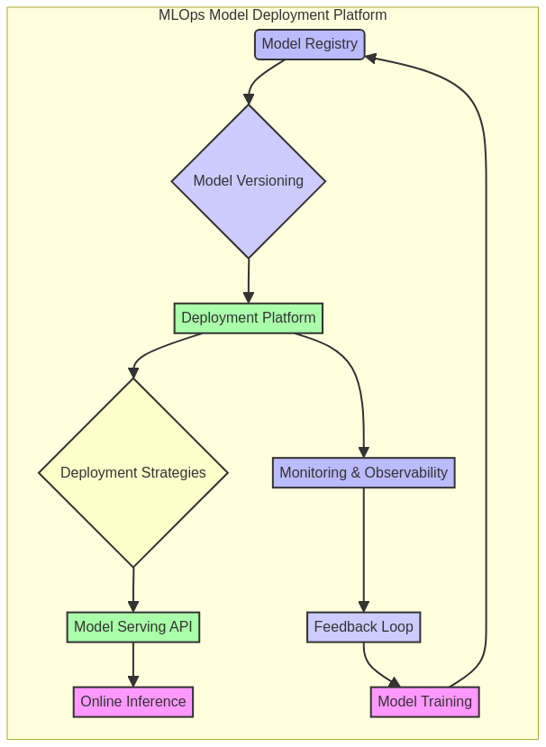

# MLOps Model Deployment Platform


---

## 🇧🇷 Plataforma de Deploy de Modelos MLOps

Este repositório apresenta uma **plataforma completa para o deploy e gerenciamento de modelos de Machine Learning (ML) em produção**, seguindo as melhores práticas de MLOps. O foco é em automatizar o ciclo de vida do modelo, desde o treinamento e versionamento até a implantação, monitoramento e retreinamento, garantindo **escalabilidade, confiabilidade e reprodutibilidade** em ambientes de produção.

### 🎯 Objetivo

O principal objetivo deste projeto é **fornecer um guia detalhado e exemplos de código funcional** para engenheiros de ML, cientistas de dados e arquitetos que buscam construir ou otimizar suas pipelines de MLOps. Serão abordados os conceitos fundamentais, ferramentas e tecnologias para criar uma plataforma robusta de deploy de modelos, com ênfase em **versionamento de modelos, estratégias de deployment avançadas e uma API de inferência em tempo real**.

### ✨ Destaques

- **Versionamento de Modelos**: Implementação de um registro de modelos (`ModelRegistry`) que suporta versionamento (`ModelMetadata`), permitindo o gerenciamento de diferentes versões de modelos e seus metadados associados.
- **Estratégias de Deployment Avançadas**: Suporte a diversas estratégias de deployment, como **Blue/Green** e **Canary Releases**, para garantir transições seguras e controladas de modelos em produção, minimizando riscos e tempo de inatividade.
- **API de Inferência em Tempo Real (Flask)**: Uma API RESTful construída com **Flask** para servir previsões de modelos implantados, permitindo que aplicações consumam os modelos com baixa latência e alta disponibilidade.
- **Monitoramento e Escalabilidade**: Mecanismos para simular o monitoramento de modelos em produção e a capacidade de escalar deployments (`scale_deployment`) para lidar com cargas de trabalho variáveis, garantindo resiliência e performance.
- **Automação Completa**: Demonstração de como automatizar o ciclo de vida do modelo, desde o registro até o deploy e undeploy, seguindo princípios de CI/CD.
- **Código Profissional**: Exemplos de código bem estruturados, seguindo as melhores práticas da indústria, com foco em modularidade, reusabilidade e manutenibilidade.
- **Documentação Completa**: Cada componente da plataforma é acompanhado de documentação detalhada, diagramas explicativos e casos de uso práticos.
- **Testes Incluídos**: Módulos de código validados através de testes unitários e de integração, garantindo a robustez e a confiabilidade das soluções.

### 🚀 Benefícios do MLOps em Ação

A implementação de práticas de MLOps traz uma série de benefícios cruciais para o desenvolvimento e operação de modelos de ML em escala. Este projeto ilustra como esses benefícios são alcançados:

1.  **Ciclo de Vida Acelerado:** A automação do registro, deployment e monitoramento de modelos acelera o tempo de lançamento de novos modelos e atualizações.

2.  **Confiabilidade e Estabilidade:** Estratégias de deployment como Blue/Green e Canary garantem que novas versões de modelos sejam introduzidas com segurança, minimizando o impacto em caso de falhas.

3.  **Reprodutibilidade:** O versionamento de modelos e a gestão de metadados permitem a reprodução exata de deployments anteriores, essencial para auditorias e depuração.

4.  **Colaboração Aprimorada:** A plataforma fornece uma interface padronizada para cientistas de dados e engenheiros de ML interagirem com o ciclo de vida do modelo.

5.  **Monitoramento Contínuo:** Embora simulado, o framework prevê a integração de ferramentas de monitoramento para detectar problemas de performance e *drift* de dados/modelo, acionando ações corretivas.

6.  **Governança e Conformidade:** O registro de modelos e o rastreamento de versões fornecem a base para uma governança robusta e conformidade com regulamentações.

---

## 🇬🇧 MLOps Model Deployment Platform

This repository presents a **complete platform for deploying and managing Machine Learning (ML) models in production**, following MLOps best practices. The focus is on automating the model lifecycle, from training and versioning to deployment, monitoring, and retraining, ensuring **scalability, reliability, and reproducibility** in production environments.

### 🎯 Objective

The main objective of this project is to **provide a detailed guide and functional code examples** for ML engineers, data scientists, and architects looking to build or optimize their MLOps pipelines. It will cover fundamental concepts, tools, and technologies to create a robust model deployment platform, with an emphasis on **model versioning, advanced deployment strategies, and a real-time inference API**.

### ✨ Highlights

- **Model Versioning**: Implementation of a `ModelRegistry` that supports versioning (`ModelMetadata`), allowing the management of different model versions and their associated metadata.
- **Advanced Deployment Strategies**: Support for various deployment strategies, such as **Blue/Green** and **Canary Releases**, to ensure safe and controlled transitions of models in production, minimizing risks and downtime.
- **Real-time Inference API (Flask)**: A RESTful API built with **Flask** to serve predictions from deployed models, allowing applications to consume models with low latency and high availability.
- **Monitoring and Scalability**: Mechanisms to simulate monitoring of models in production and the ability to scale deployments (`scale_deployment`) to handle varying workloads, ensuring resilience and performance.
- **Full Automation**: Demonstration of how to automate the model lifecycle, from registration to deployment and undeployment, following CI/CD principles.
- **Professional Code**: Well-structured code examples, following industry best practices, with a focus on modularity, reusability, and maintainability.
- **Complete Documentation**: Each platform component is accompanied by detailed documentation, explanatory diagrams, and practical use cases.
- **Tests Included**: Code modules validated through unit and integration tests, guaranteeing the robustness and reliability of the solutions.

### 📊 Visualization



*Diagrama ilustrativo da arquitetura da Plataforma de Deploy de Modelos MLOps, destacando os principais componentes e o fluxo de trabalho.*


---

## 🛠️ Tecnologias Utilizadas / Technologies Used

| Categoria         | Tecnologia      | Descrição                                                                 |
| :---------------- | :-------------- | :------------------------------------------------------------------------ |
| **Linguagem**     | Python          | Linguagem principal para desenvolvimento da plataforma MLOps e API.       |
| **Framework Web** | Flask           | Utilizado para construir a API RESTful de inferência de modelos.          |
| **Contêineres**   | Docker          | Para empacotar modelos e suas dependências, garantindo portabilidade.     |
| **Orquestração**  | Kubernetes      | (Conceitual) Para orquestração e gerenciamento de deployments em escala.  |
| **Versionamento** | MLflow          | (Conceitual) Para rastreamento de experimentos e registro de modelos.     |
| **Serialização**  | Pickle / JSON   | Para persistência de modelos e comunicação da API.                        |
| **Testes**        | `unittest`      | Framework de testes padrão do Python para validação de funcionalidades.   |
| **Diagramação**   | Mermaid         | Para criação de diagramas de arquitetura e fluxo de trabalho no README.   |
| **Dados**         | `pandas`, `numpy` | Para manipulação e geração de dados no exemplo avançado.                  |
| **ML**            | `scikit-learn`  | Para treinamento de modelos de Machine Learning no exemplo avançado.      |

---

## 📁 Repository Structure

```
mlops-model-deployment-platform/
├── src/
│   ├── __init__.py
│   ├── model_deployment.py      # Lógica principal da plataforma de deployment
│   ├── model_serving_api.py     # Implementação da API Flask para inferência
│   └── advanced_example.py      # Módulo de exemplo avançado com treinamento e deploy
├── tests/                       # Testes unitários e de integração
├── examples/                    # Exemplos de uso da plataforma
├── diagrams/                    # Diagramas de arquitetura (Mermaid)
├── images/                      # Imagens para o README e documentação
├── API_DOCUMENTATION.md         # Documentação detalhada da API REST e Python
├── CONTRIBUTING.md              # Guia de contribuição
├── requirements.txt             # Dependências Python
├── setup.py                     # Script de instalação do pacote
└── README.md                    # Este arquivo
```

---

## 🚀 Getting Started

Para começar, clone o repositório e explore os diretórios `src/` e `examples/` para exemplos detalhados e instruções de uso. Certifique-se de ter as dependências necessárias instaladas.

### Pré-requisitos

- Python 3.9+
- `pip` (gerenciador de pacotes Python)
- `scikit-learn` (para o modelo de exemplo)
- `pandas` (para manipulação de dados no exemplo avançado)
- `requests` (para interagir com a API no exemplo avançado)
- `flask` (para a API de inferência)

### Instalação

#### Opção 1: Instalação com Virtual Environment (Recomendado)

```bash
# Clone o repositório
git clone https://github.com/galafis/mlops-model-deployment-platform.git
cd mlops-model-deployment-platform

# Crie um ambiente virtual
python -m venv venv

# Ative o ambiente virtual
# No Linux/Mac:
source venv/bin/activate
# No Windows:
venv\Scripts\activate

# Instale as dependências
pip install -r requirements.txt
```

#### Opção 2: Instalação Direta

```bash
git clone https://github.com/galafis/mlops-model-deployment-platform.git
cd mlops-model-deployment-platform

# Instalar dependências Python
pip install -r requirements.txt
```

### Verificação da Instalação

Execute os testes para garantir que tudo está funcionando corretamente:

```bash
# Executar todos os testes
pytest tests/ -v

# Executar testes com coverage
pytest tests/ -v --cov=src --cov-report=term
```

---

## 📖 Guia de Uso

### Exemplo Básico: Registro e Deployment de Modelo

```python
from src.model_deployment import (
    DeploymentPlatform, 
    Model, 
    ModelMetadata, 
    DeploymentConfig, 
    DeploymentStrategy
)

# 1. Inicializar a plataforma
platform = DeploymentPlatform("my-mlops-platform")

# 2. Criar metadados do modelo
metadata = ModelMetadata(
    name="my-classifier",
    version="1.0.0",
    framework="scikit-learn",
    author="seu-email@exemplo.com",
    description="Modelo de classificação para predição de churn",
    metrics={"accuracy": 0.95, "f1_score": 0.93},
    tags=["classification", "production"]
)

# 3. Criar e registrar o modelo
model = Model(metadata)
platform.registry.register_model(model)

# 4. Promover para staging e produção
model.promote_to_staging()
platform.save_registry()
model.promote_to_production()
platform.save_registry()

# 5. Fazer deployment
config = DeploymentConfig(
    strategy=DeploymentStrategy.BLUE_GREEN,
    replicas=3,
    auto_scaling=True,
    min_replicas=2,
    max_replicas=10
)
endpoint = platform.deploy_model(model, config)
print(f"Modelo implantado em: {endpoint}")

# 6. Fazer previsão
input_data = {"features": [[0.5, 0.3, 0.8]]}
prediction = platform.predict("my-classifier", "1.0.0", input_data)
print(f"Previsão: {prediction}")
```

### Exemplo Avançado com API Flask

Execute o exemplo avançado completo que demonstra todo o ciclo de vida MLOps:

```bash
python src/advanced_example.py
```

Este exemplo demonstra:
- ✅ Geração de dados sintéticos
- ✅ Treinamento de modelo RandomForest
- ✅ Registro e versionamento de modelos
- ✅ Deployment com estratégia Blue/Green
- ✅ API de inferência em tempo real
- ✅ Canary release para nova versão
- ✅ Rollback e gestão de tráfego

### Usando a API REST

Inicie o servidor da API:

```python
from src.model_serving_api import app

if __name__ == "__main__":
    app.run(host='0.0.0.0', port=5001, debug=False)
```

Endpoints disponíveis:

```bash
# Listar todos os modelos
curl http://localhost:5001/models

# Listar deployments ativos
curl http://localhost:5001/deployments

# Fazer previsão
curl -X POST http://localhost:5001/predict/my-classifier/1.0.0 \
  -H "Content-Type: application/json" \
  -d '{"features": [[0.5, 0.3, 0.8]]}'

# Registrar novo modelo
curl -X POST http://localhost:5001/register_model \
  -H "Content-Type: application/json" \
  -d '{
    "name": "new-model",
    "version": "1.0.0",
    "framework": "scikit-learn",
    "author": "user@example.com",
    "description": "New model"
  }'

# Fazer deployment
curl -X POST http://localhost:5001/deploy_model \
  -H "Content-Type: application/json" \
  -d '{
    "model_name": "new-model",
    "model_version": "1.0.0",
    "strategy": "BLUE_GREEN",
    "replicas": 2
  }'
```

---

## 🧪 Executando Testes

### Executar Todos os Testes

```bash
pytest tests/ -v
```

### Executar Testes com Coverage

```bash
pytest tests/ -v --cov=src --cov-report=html --cov-report=term
```

Isso gerará um relatório HTML em `htmlcov/index.html` que você pode abrir no navegador.

### Executar Testes Específicos

```bash
# Executar apenas testes de deployment
pytest tests/test_model_deployment.py -v

# Executar apenas testes de integração
pytest tests/test_integration.py -v

# Executar teste específico
pytest tests/test_model_deployment.py::TestModelDeployment::test_register_model -v
```

### Testes de Cobertura Atual

A plataforma possui **14 testes** cobrindo:
- ✅ Registro e versionamento de modelos
- ✅ Transições de status de modelos
- ✅ Deployment com diferentes estratégias
- ✅ Escalabilidade de deployments
- ✅ Persistência de registro e deployments
- ✅ Endpoints da API REST
- ✅ Ciclo de vida completo de modelos

---

## 🏗️ Arquitetura

### Componentes Principais

```
┌─────────────────────────────────────────────────────────────┐
│                    MLOps Platform                           │
├─────────────────────────────────────────────────────────────┤
│                                                             │
│  ┌──────────────┐    ┌──────────────┐    ┌──────────────┐ │
│  │   Model      │───▶│  Deployment  │───▶│    Flask     │ │
│  │  Registry    │    │   Platform   │    │     API      │ │
│  └──────────────┘    └──────────────┘    └──────────────┘ │
│         │                    │                    │        │
│         ▼                    ▼                    ▼        │
│  ┌──────────────┐    ┌──────────────┐    ┌──────────────┐ │
│  │   Model      │    │  Deployment  │    │   Inference  │ │
│  │  Metadata    │    │   Configs    │    │  Endpoints   │ │
│  └──────────────┘    └──────────────┘    └──────────────┘ │
│                                                             │
└─────────────────────────────────────────────────────────────┘
```

### Fluxo de Trabalho

1. **Treinamento**: Treinar modelo offline com seus dados
2. **Registro**: Registrar modelo no `ModelRegistry` com metadados
3. **Staging**: Promover modelo para ambiente de staging
4. **Validação**: Testar modelo em staging
5. **Produção**: Promover modelo para produção
6. **Deployment**: Fazer deployment com estratégia escolhida
7. **Monitoramento**: Monitorar performance (a ser implementado)
8. **Atualização**: Fazer deploy de novas versões com Canary
9. **Rollback**: Reverter para versão anterior se necessário

---

## 🔧 Estratégias de Deployment

### Blue/Green Deployment

Estratégia que mantém dois ambientes idênticos:
- **Blue**: Versão atual em produção
- **Green**: Nova versão para deployment

Benefícios:
- ✅ Zero downtime
- ✅ Rollback instantâneo
- ✅ Testes completos antes de switch

```python
config = DeploymentConfig(
    strategy=DeploymentStrategy.BLUE_GREEN,
    replicas=3
)
```

### Canary Release

Gradualmente roteia tráfego para nova versão:
- 5-10% inicial para nova versão
- Monitoramento de métricas
- Aumento gradual até 100%

Benefícios:
- ✅ Reduz risco de falhas
- ✅ Permite validação com tráfego real
- ✅ Rollback fácil

```python
config = DeploymentConfig(
    strategy=DeploymentStrategy.CANARY,
    canary_traffic_percentage=20
)
```

---

## 📊 API Reference

### Model Operations

#### Register Model
```python
platform.registry.register_model(model)
```

#### Promote Model
```python
model.promote_to_staging()
model.promote_to_production()
```

#### Get Model
```python
model = platform.registry.get_model("model-name", "1.0.0")
production_model = platform.registry.get_production_model("model-name")
```

### Deployment Operations

#### Deploy Model
```python
endpoint = platform.deploy_model(model, config)
```

#### Scale Deployment
```python
platform.scale_deployment("model-name", "1.0.0", new_replicas=5)
```

#### Undeploy Model
```python
platform.undeploy_model("model-name", "1.0.0")
```

### Prediction Operations

#### Make Prediction
```python
prediction = platform.predict("model-name", "1.0.0", input_data)
```

---

## 🐛 Troubleshooting

### Problema: Testes falhando

**Solução**: Certifique-se de ter todas as dependências instaladas:
```bash
pip install -r requirements.txt
```

### Problema: API Flask não inicia

**Solução**: Verifique se a porta 5001 está livre:
```bash
# Linux/Mac
lsof -i :5001

# Windows
netstat -ano | findstr :5001
```

### Problema: Modelo não carrega

**Solução**: Verifique se o caminho do modelo está correto e se o arquivo existe:
```python
import os
print(os.path.exists("path/to/model.pkl"))
```

### Problema: Erro de importação

**Solução**: Adicione o diretório src ao PYTHONPATH:
```bash
export PYTHONPATH="${PYTHONPATH}:${PWD}/src"
```

---

## 🚀 Roadmap

### Em Desenvolvimento
- [ ] Integração com MLflow para tracking
- [ ] Suporte a Docker/Kubernetes
- [ ] Monitoramento de drift de dados
- [ ] Dashboard de métricas em tempo real

### Planejado
- [ ] Suporte a modelos TensorFlow/PyTorch
- [ ] A/B testing framework
- [ ] Feature store integration
- [ ] Automated retraining pipeline

---

## 🤝 Contribuição

Contribuições são bem-vindas! Por favor, leia o [CONTRIBUTING.md](CONTRIBUTING.md) para detalhes sobre nosso código de conduta e processo de submissão de pull requests.

### Como Contribuir

1. Fork o projeto
2. Crie uma branch para sua feature (`git checkout -b feature/AmazingFeature`)
3. Commit suas mudanças (`git commit -m 'feat: Add some AmazingFeature'`)
4. Push para a branch (`git push origin feature/AmazingFeature`)
5. Abra um Pull Request

---

## 📄 Licença

Este projeto está licenciado sob a Licença MIT - veja o arquivo [LICENSE](LICENSE) para detalhes.

---

## 📞 Contato

Gabriel Demetrios Lafis - [LinkedIn](https://www.linkedin.com/in/gabriel-demetrios-lafis/)

---

## 🌟 Agradecimentos

Um agradecimento especial a todos os recursos de código aberto e à comunidade MLOps que tornam projetos como este possíveis.

